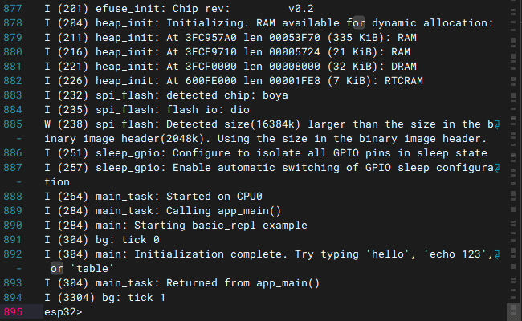

# ESP-IDF Async Console

This is a non-blocking, async REPL (Read-Evaluate-Print-Loop) console component for ESP-IDF that allows `ESP_LOG` messages to cleanly interleave with the active serial prompt without screen corruption or dropped input.

This component is built on a fork of the [ESP-IDF Console component](https://docs.espressif.com/projects/esp-idf/en/stable/esp32/api-reference/system/console.html), primarily re-writing `linenoise` as a character-feed state machine so the console REPL runs in a FreeRTOS task without blocking on `read()`.



## Features

- **Non-blocking I/O** - the REPL task polls for input via `linenoiseEditFeed()`, yielding to the scheduler between characters
- **Clean log interleaving** - `ESP_LOG` output displays above the prompt without corrupting your current input
  - Under the hood it hooks `esp_log_set_vprintf()` to erase the prompt line, print the log, and then restore the prompt line
- **"Smart" terminal auto-detection** - probes for VT100/ANSI capabilities and upgrades/falls back to dumb mode as needed.
- **3-mode terminal control** - `AUTO` (default), `SMART` (forced), or `DUMB` (forced)
- **Full line editing** - history, tab completion, inline hints, Home/End, Delete, Ctrl+W, Ctrl+L, Ctrl+A/E/C/D
- **Easy setup** - registers commands via the standard `esp_console_cmd_register()` API. The `help` command is registered automatically

## Requirements

- ESP-IDF **≥ 5.3** (tested on v5.3.5 & v6.0.2)

## Installation

```bash
idf.py add-dependency "jwidess/esp-async-console^0.1.0"
```

Or add manually to your project's `idf_component.yml`:

```yaml
dependencies:
  jwidess/esp-async-console: "^0.1.0"
```

## Usage

### Minimal setup

```c
#include "async_console.h"
#include "esp_console.h"
#include "nvs_flash.h"

void app_main(void)
{
    ESP_ERROR_CHECK(nvs_flash_init());
    ESP_ERROR_CHECK(async_console_init(UART_NUM_0, 115200, "esp32> "));

    // Register commands using the standard ESP-IDF API
    const esp_console_cmd_t cmd = {
        .command = "hello",
        .help    = "Say hello",
        .func    = &cmd_hello,
    };
    ESP_ERROR_CHECK(esp_console_cmd_register(&cmd));
}
```

`async_console_init()` handles UART driver installation, `esp_console_init()`, the log hook, and spawning the REPL FreeRTOS task. The `help` command is registered automatically.


### Custom tab completion

The component registers `esp_console_get_completion` by default for command-name completion. To add argument-level completion, override the callback after `async_console_init()`:

```c
#include "linenoise/async_linenoise.h"

static void my_completion(const char *buf, linenoiseCompletions *lc) {
    esp_console_get_completion(buf, lc);  // keep command-name completions

    if (strncmp(buf, "mycommand ", 10) == 0) {
        linenoiseAddCompletion(lc, "mycommand option_a");
        linenoiseAddCompletion(lc, "mycommand option_b");
    }
}

// After async_console_init():
linenoiseSetCompletionCallback(my_completion);
```

### Terminal mode

The console defaults to `LINENOISE_MODE_AUTO`. Under `AUTO` mode, it auto detects if the connected terminal supports smart VT100/ANSI capabilities. If detection fails, the console falls back to **dumb mode**.

In **dumb mode**, the console assumes a basic serial terminal without VT100/ANSI escape sequence support. Features like command history (Up/Down arrows), hints, tab completion, and cursor movement (Left/Right arrows) **do not work**. The console simply echoes printable characters, handles basic backspaces, and submits the line upon receiving a newline. This can be useful for raw logging, automation, or legacy serial monitors.

Under `AUTO` mode, the console auto-detects and upgrades to smart (VT100/ANSI) mode via two mechanisms:

1. **Active Probing (Boot & Empty Line Submissions)**:
   An active cursor-position query (`ESC [ 6n`) is sent to the terminal on boot, and **whenever the user presses Enter on an empty line**. If the terminal emulator responds, the console immediately upgrades to smart mode.
2. **Passive ESC Sequence Detection**:
   If the user presses a key that transmits an escape sequence (such as an arrow, Home, End, PageUp/Down, etc.) while in dumb mode, the console immediately upgrades to smart mode.

You can override this with:

```c
linenoiseSetTerminalMode(LINENOISE_MODE_SMART); // Force smart mode
linenoiseSetTerminalMode(LINENOISE_MODE_DUMB);  // Force dumb mode
linenoiseSetTerminalMode(LINENOISE_MODE_AUTO);  // Auto mode
```

Short transition messages (`--- Upgraded to smart terminal ---`) are printed by default when the detected mode changes. To disable them:

```c
linenoiseSetModeMessages(false);
```

### Debug mode

Enables verbose logging of raw bytes received and probe timing:

```c
esp_console_set_debug_mode(true);
```

### Console Limits

By default, the console supports command lines up to **256 characters** and **8 arguments** (including the command name). You can increase these limits via `idf.py menuconfig`:

* `Component config` -> `Async Console Configuration`
  * `Maximum command line arguments` *(Note: ESP-IDF reserves 1 slot for the command name and 1 for a NULL terminator. E.g. 16 allows the command + 14 arguments.)*
  * `Maximum command line length` (e.g., 512)

*(Note: Standard ESP-IDF console settings like `CONFIG_CONSOLE_SORTED_HELP`, are used by this component.)*

## API Reference

### `async_console.h`

| Function | Description |
|---|---|
| `async_console_init(uart, baud, prompt)` | Initialize and start the async REPL task |
| `esp_console_set_debug_mode(bool)` | Enable/disable raw RX debug logging |

### `linenoise/async_linenoise.h`

Additions to the standard linenoise API:

| Function | Description |
|---|---|
| `linenoiseSetTerminalMode(mode)` | Set `AUTO` / `SMART` / `DUMB` mode |
| `linenoiseGetTerminalMode()` | Get configured terminal mode |
| `linenoiseSetModeMessages(bool)` | Toggle mode change notifications |
| `linenoiseGetModeMessages()` | Get notification state |
| `linenoiseEditStart(l, buf, len, prompt)` | Begin a non-blocking edit session |
| `linenoiseEditFeed(l)` | Feed one byte; returns `linenoiseEditMore` until a line is complete |
| `linenoiseEditStop(l)` | End the edit session |
| `linenoiseHide(l)` | Erase the prompt (for async log output) |
| `linenoiseShow(l)` | Restore the prompt after log output |

## Example

The [`basic_repl`](examples/basic_repl/) example demonstrates all features:

- Background task with `ESP_LOG` messages every few seconds, cleanly interleaved with the prompt
- `terminalmode [auto\|smart\|dumb]` - view or force terminal mode
- `modemessages` - toggle mode change notifications
- `debugmode [on\|off]` - toggle debug
- `table` - prints a large table
- `echo <args>`, `hello`, `reboot`
- Argument tab completion for `terminalmode` and `debugmode`

## Architecture

```
app_main()
  └─ async_console_init()
       ├─ UART driver + VFS setup
       ├─ esp_console_init()  (registers 'help', argtable3)
       ├─ async_console_io_init()           (creates g_log_mutex)
       ├─ async_console_log_hook_install()  (hooks esp_log_set_vprintf)
       └─ xTaskCreate(console_repl_task)
            └─ loop: linenoiseEditFeed() -> esp_console_run()

ESP_LOG* from any task
  └─ async_console_log_vprintf()
       ├─ xSemaphoreTake(g_log_mutex)
       ├─ linenoiseHide()   (erase prompt line)
       ├─ fwrite(log)
       ├─ linenoiseShow()   (restore prompt line)
       └─ xSemaphoreGive(g_log_mutex)
```

## License

- Component code: **Apache License 2.0**
- `linenoise` fork (`linenoise/`): **2-Clause BSD License** (original copyright Salvatore Sanfilippo & Pieter Noordhuis)
- *Note: This component depends on the ESP-IDF `console` component (Apache-2.0) and its  `argtable3` dependency (3-Clause BSD).*